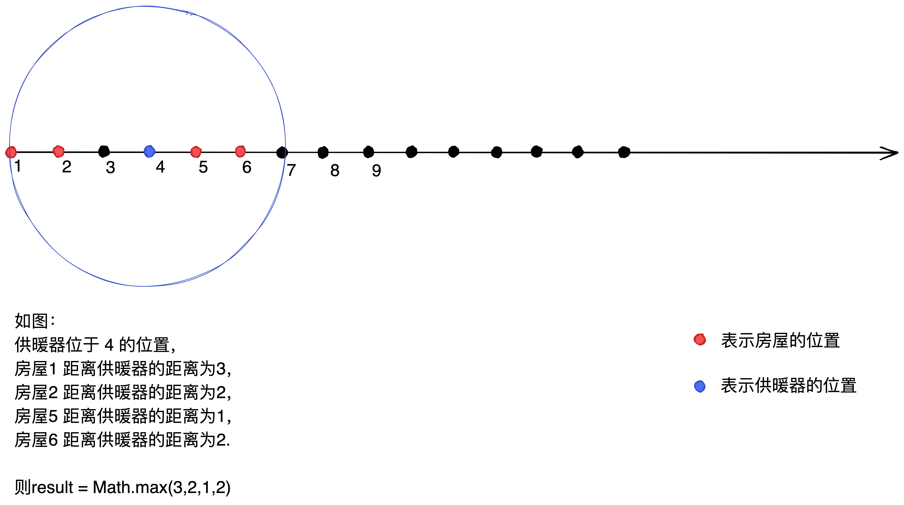

# 475.供暖器
- 题目难度：˙中等
- [题目链接](https://leetcode-cn.com/problems/heaters/)
## 一、供暖器
冬季已经来临。你的任务是设计一个有固定加热半径 的供暖器向所有房屋供暖。
在加热器的加热半径范围内的每个房屋都可以获得供暖。
​

现在，给出位于一个水平线上的房屋 `houses` 和 供暖器 `heaters` 的位置，请你找出并返回可以覆盖所有房屋的最小加热半径。
**说明：**所有供暖器都遵循你的半径标准，加热的半径也一样。


#### 大白话解释
`houses[]` 表示的房屋的位置(一维数组)，房屋位于水平线上。
`heaters[]` 表示的是供暖器的位置(一维数组)，位于房屋水平线上的某一个位置，我们以当前位置画圆，找到能覆盖全部房屋的最小半径。



#### 示例说明

- 示例 1
```java
输入：
int[] houses = new int[1,2,3,4];
int[] heaters = new int[1,4];

输出：1

解释：供暖器位于 1 和 4 的位置。
房屋1 距离供暖器1的距离为 0，房屋1 距离供暖器4的距离为3，则最小半径为 0
房屋2 距离供暖器1的距离为 1，房屋2 距离供暖器4的距离为2，则最小半径为 1
房屋3 距离供暖器1的距离为 2，房屋3 距离供暖器4的距离为1，则最小半径为 1
房屋4 距离供暖器1的距离为 3，房屋4 距离供暖器4的距离为0，则最小半径为 0
    
result = 所有最小半径中的最大值 = 1
```

- 示例 2 
```java
输入： 
int[] houses = new int[1,5];
int[] heaters = new int[2];

输出：3

解释：供暖器位于 2 的位置
房屋1 距离供暖器2的距离为 1，则最小半径为 1
房屋5 距离供暖器2的距离为 3，则最小半径为 3
 
result = 所有最小半径的的最大值 = 3
```
## 二、算法实现
通过二分查找的方式实现。我们将`houses`中的每个房屋作为目标值 `target`,在 `heaters` 中找到最后一个小于 `target`的元素 `i`，根据最后一个小于 `target`的元素 `i+ 1` 可以得到第一个大于 `target`的元素 `j`。
通过找到的两个元素 `i` 和 `j` 分别计算距离 `house`的距离，并求出最小值`minDistance`。
找到所有房屋最小半径中的最大值就是我们的结果。
​

```java
public int findRadius(int[] houses,int[] heaters){
	int result = 0;
    //# 对 heaters中的元素进行排序
    Arrasy.sort(heaters);
    
    for(int house: houses){
        //# 通过二分查找变异方式：查找最后一个小于target的元素
        int i = binarySearch(heaters,house);
        int j = i + 1;//# 获取第一个大于target的元素
        //# 供暖器位于房子的左侧，计算左侧的距离
        int leftDis = i < 0 ? Integer.MAX_VALUE : house - heaters[i];
        //# 供暖器位于房子的右侧，计算右侧的距离
        int rightDis = j >= heaters.length ? Integer.MAX_VALUE : heaters[j] - house;
        //# 找到距离房子最小的半径距离
        int minDis = Math.min(leftDis,rightDis);
        result = Math.max(result,minDis);
        
    }
    return result;
}
//# 通过二分查找，找到最后一个小于target的元素的位置
public int binarySearch(int[] nums,int target){
	int left = 0,right = nums.length - 1;
    
    while(left <= right){
    	int mid = left + ((right - left) >> 1);
        
        if(nums[mid] > target){
        	right = mid - 1;
        } else{
            //# 如果mid == heaters.length - 1 说明已经是最后一个元素，没有大于target的元素，则mid就是小于target的最后一个元素
                //# 如果mid 是小于target的最后一个元素，则mid + 1的元素一定大于target
        	if(mid == nums.length - 1 || nums[mid + 1] > target){
            	return mid;
            }
            left = mid + 1;
        }
    }
    
    return -1;
}
```
